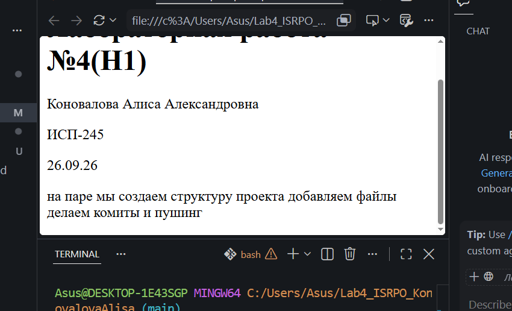

# H1 Заголовок

## H2 Заголовок

### H3 Заголовок

#### H4 Заголовок

##### H5 Заголовок

###### H6 Заголовок

---

**Жирный текст**
_Курсив_
~~Зачёркнутый~~
`Моноширный`

- Маркированный список

1. Нумерованный список
   - Вложенный список

> Пример цитаты

```bash
git status
```

| Столбец 1 | Столбец 2 | Столбец 3 |
| :-------- | :-------: | --------: |
| a         |     b     |         c |



[Внешняя ссылка](https://github.com)
[Внутренняя ссылка](#h1-заголовок)

- [x] Сделано
- [ ] Не сделано

> [!NOTE]
> Пример заметки

$a^2 + b^2 = c^2$

$$
\sum_{i=1}^n i = \frac{n(n+1)}{2}
$$
